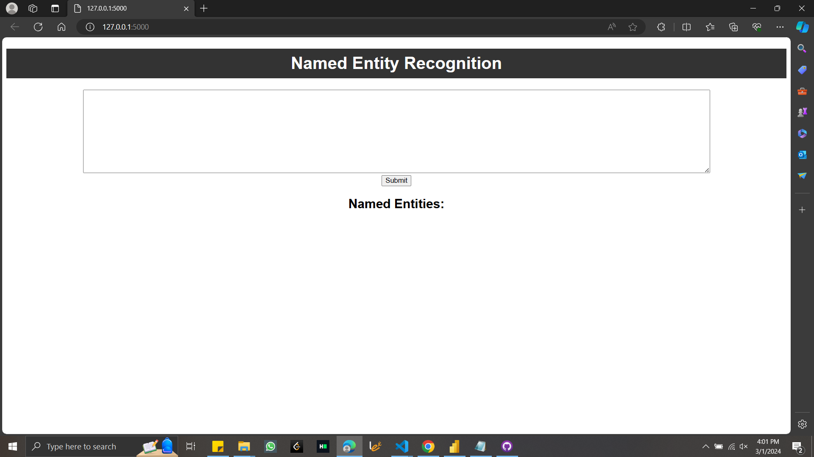
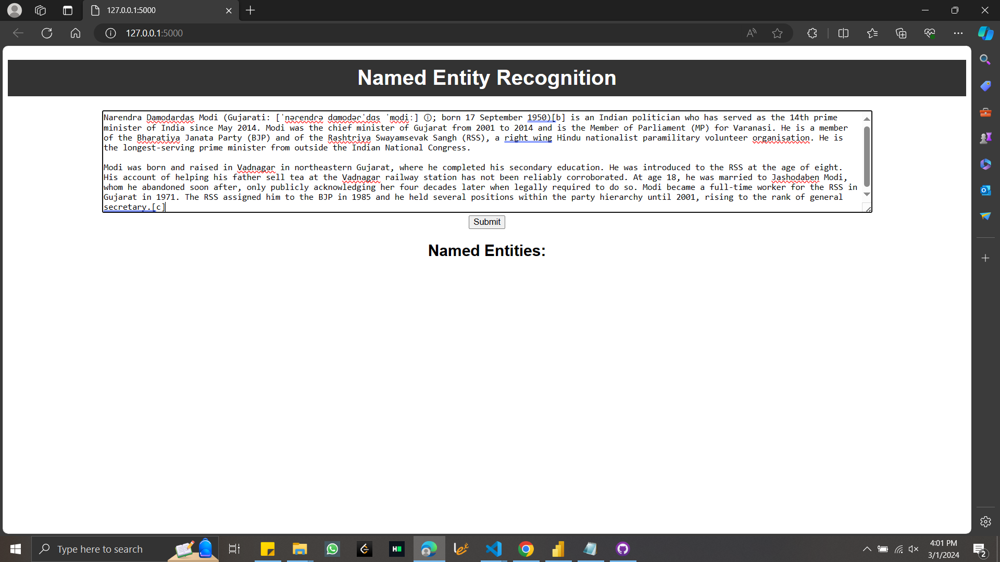
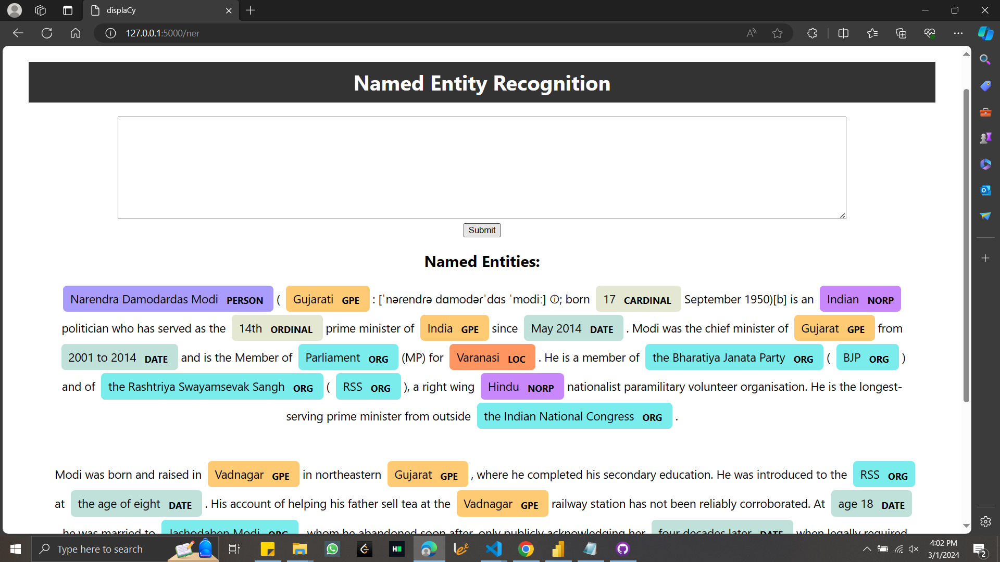
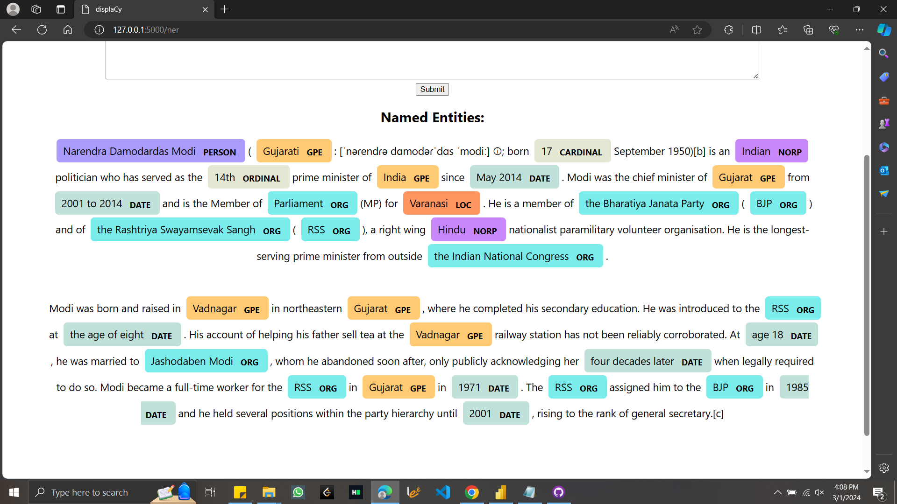

**Project Overview:**

This project implements a simple Named Entity Recognition (NER) model using Python's Natural Language Processing (NLP) libraries. The NER model is capable of detecting and tagging entities in text data, highlighting them with different colors. The model is integrated into a user-friendly web interface created using Flask, allowing users to input text and view the identified entities along with their corresponding tags.

**Screenshots:**

 
   - This screenshot showcases the main interface of the application, where users can input text for entity recognition.

 
   - This screenshot displays the interface with text input provided in the designated box.

 
   
   - Here, the output of the NER model is presented with the identified entities highlighted within the same paragraph.

**Features:**

- Named Entity Recognition: The model employs NLP techniques to recognize and tag entities such as persons, organizations, locations, dates, and more within the provided text.
  
- Color Highlighting: Identified entities are highlighted with different colors for improved visualization and clarity.

- User-friendly Interface: The web interface developed using Flask enables users to conveniently input text and view the NER model's output with highlighted entities.

**Dependencies:**

- Python 3.x
- Flask
- SpaCy
- HTML/CSS
- JavaScript

**Usage:**

1. Clone the repository to your local machine.
2. Install the required dependencies using `pip install -r requirements.txt`.
3. Run the Flask application using `python app.py`.
4. Access the application through your web browser at `http://localhost:5000`.
5. Input text into the provided textbox and submit to view the identified entities highlighted within the output.

**Contributing:**

Contributions to this project are welcome! If you have any suggestions, enhancements, or bug fixes, feel free to submit a pull request or open an issue on the GitHub repository.

**License:**

This project is licensed under the MIT License. See the [LICENSE](LICENSE) file for more details.

**Acknowledgments:**

Special thanks to the developers of SpaCy and Flask for their invaluable contributions to the NLP and web development communities.

